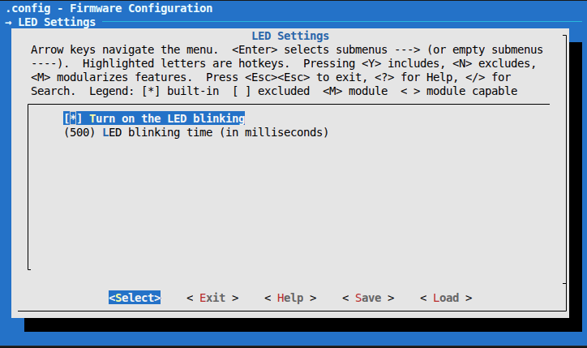

# STM32F411CEU6 Makefile, Kconfig test

Test bare-metale project using MakeFile and Kconfig in C language for the STM32F411CEU6 (Black Pill) microcontroller. Low-level GPIO register mappingand register-level programming based on technical documentation:

- **RM0383 Reference manual**: STM32F411xC/E advanced Arm®-based 32-bit MCUs

- **PM0214 Programming manual**: STM32 Cortex®-M4 MCUs and MPUs programming manual

---
The purpose of the project is to control the built-in LED on pin PC13.
In the Kconfig menu it is possible to turn the LED blinking on and off and enter the blinking time in [ms].

---
To open the interactive configuration menu and change LED settings:
make menuconfig

To compile the source code and generate the final .bin and .elf files:
make

To delete all temporary object files, binaries, and local configurations to start fresh:
make clean
